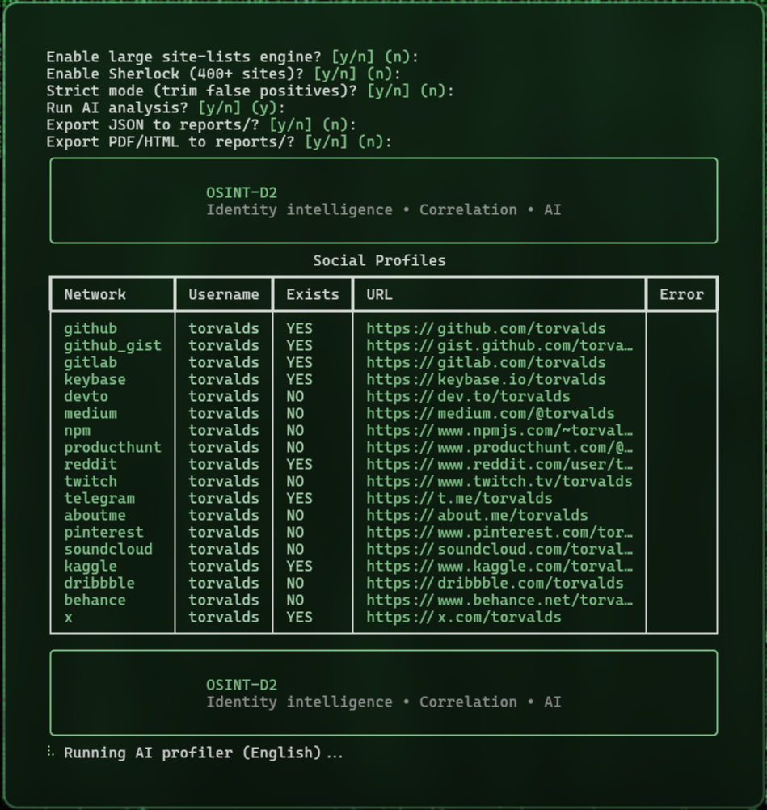
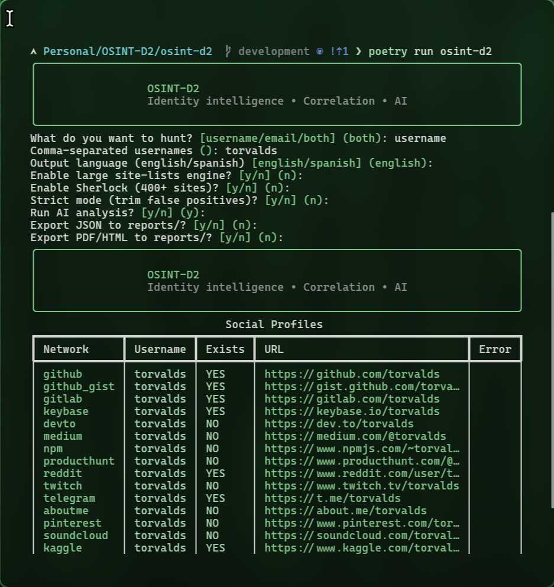
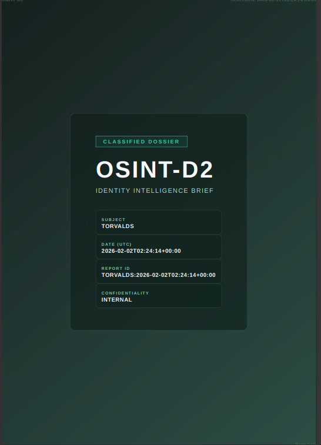

# OSINT-D2

[](#installation)
[](#installation)
[-111827?logo=openai&logoColor=white)](#ai-and-language)
[](LICENSE)

```text
   ____  ____ ___ _   _ _____     ____  ____
  / __ \/ __ `__ \ | | |_   _|   / __ \/ __ \
 / / / / / / / / / | | | | |    / / / / / / /
/ /_/ / /_/ /_/ /| |_| | | |   / /_/ / /_/ /
\____/\__,_|\__,_| \__,_| |_|   \____/\____/
```

**Advanced identity correlation and cognitive profiling CLI**

OSINT-D2 ingests usernames and/or emails, aggregates public evidence from multiple OSINT sources, and enriches the dataset with targeted scrapers. A DeepSeek/OpenAI-compatible analyst can turn the evidence into hypothesis-driven intelligence. The CLI defaults to English while still supporting a full Spanish experience (`--spanish`).

## Highlights

- Multi-source correlation that links usernames, emails, and derived aliases in a single run.
- Modular async pipeline with reusable services, Sherlock integration, and support for WhatsMyName-style site lists.
- Cognitive AI analysis (`--deep-analyze`) generating structured summaries, highlights, and confidence levels.
- Professional dossier exports (JSON + PDF/HTML) suitable for incident response or executive briefings.
- Typer + Rich CLI with contextual help, interactive wizard, and JSON-first automation outputs.



## Installation

**Prerequisites**

- Python 3.11 or newer
- Poetry
- WeasyPrint system dependencies (for PDF generation)

**Setup**

```bash
git clone https://github.com/Doble-2/osint-d2.git
cd osint-d2
poetry install
```

Copy `.env.example` to `.env` and configure at least:

- `OSINT_D2_AI_API_KEY`

Optional overrides:

- `OSINT_D2_AI_BASE_URL` (defaults to DeepSeek)
- `OSINT_D2_AI_MODEL`
- `OSINT_D2_AI_TIMEOUT_SECONDS`
- `OSINT_D2_DEFAULT_LANGUAGE` (`en` or `es`)

> PDF exports rely on WeasyPrint 60.1 and pydyf < 0.11 for compatibility.

## Quick Start

Interactive wizard (default command):

```bash
poetry run osint-d2
```

Direct help:

```bash
poetry run osint-d2 --help
poetry run osint-d2 hunt --help
```



## Command Reference

| Command | Summary |
| --- | --- |
| `wizard` | Guided workflow asking for usernames/emails, language, Sherlock, site-lists, and exports. |
| `scan` | Lightweight username sweep across built-in sources. |
| `scan-email` | Email-centric scan with optional local-part username pivot. |
| `hunt` | Full pipeline orchestrating usernames, emails, Sherlock, and site-lists with optional AI. |
| `analyze` | Re-run AI analysis against a previously exported JSON dossier. |
| `doctor` | Environment diagnostics (HTTP connectivity, WeasyPrint smoke test, config checks). |

Key flags (apply to the relevant commands):

- `--site-lists / --no-site-lists` enables large data-driven site manifests.
- `--sherlock / --no-sherlock` downloads and executes the Sherlock manifest (~400 sites).
- `--strict / --no-strict` applies defensive heuristics to reduce false positives.
- `--export-json` writes `reports/<target>.json`.
- `--export-pdf` writes `reports/<target>.pdf` (falls back to HTML if PDF fails).
- `--format json` produces machine-friendly output (recommended for automation).
- `-s, --spanish / --english` toggles localized prompts and AI analysis.

Examples:

```bash
# Full hunt: usernames, email, Sherlock, site lists, PDF dossier
poetry run osint-d2 hunt \
  --usernames exampleuser \
  --emails user@example.com \
  --site-lists \
  --sherlock \
  --strict \
  --export-pdf

# Quick email triage with AI analysis disabled
poetry run osint-d2 scan-email user@example.com --no-deep-analyze

# Re-run the AI profiler over an exported dossier in Spanish
poetry run osint-d2 analyze reports/example.json --spanish
```

## AI and Language

- English is the default CLI and AI language. Use `--spanish` (or `OSINT_D2_DEFAULT_LANGUAGE=es`) to switch.
- AI analysis is optional. When enabled, the AsyncOpenAI client targets the DeepSeek-compatible endpoint and may retry transient errors.
- `--json-raw` embeds the provider payload under `analysis.raw` for auditing.
- Treat AI output as hypothesis generation; always confirm with primary evidence.


## Reports

- JSON exports mirror the internal Pydantic models, making them easy to post-process.
- PDF/HTML dossiers are rendered via Jinja2 templates and WeasyPrint, including summary tables and AI narratives when available.
- Exports are written under `reports/` with filenames sanitised via the pipeline helpers.



## Architecture

- `src/core/` domain models, configuration, resources loader, and orchestrating services (identity pipeline, language utilities).
- `src/adapters/` integrations: HTTP client, Sherlock runner, site lists, AI analyst, exporters, specific scrapers.
- `src/cli/` Typer commands, interactive wizard, doctor utilities, and Rich UI components.

The CLI delegates business logic to the service layer (`core/services/identity_pipeline.py`), keeping commands thin and testable. Async operations are wrapped with `asyncio.run(...)` to stay Typer-friendly.

## Troubleshooting

- `poetry run osint-d2 doctor` validates API keys, HTTP connectivity, and WeasyPrint support.
- Enable `--format json` to capture exact outputs for bug reports or automated pipelines.
- Use `--no-deep-analyze` if you prefer to skip AI calls during debugging.

## Disclaimer

OSINT-D2 is intended for lawful defensive and investigative use (incident response, fraud, brand protection, self-audits). Respect privacy, terms of service, and local regulations.

- Do not use this tool for harassment, doxxing, or unauthorized intrusion.
- Correlation workflows can produce false positives; verify with additional evidence.
- AI-generated content can be biased or incorrect; treat it as guidance rather than fact.

Released under the MIT License. See [LICENSE](LICENSE) for details.
