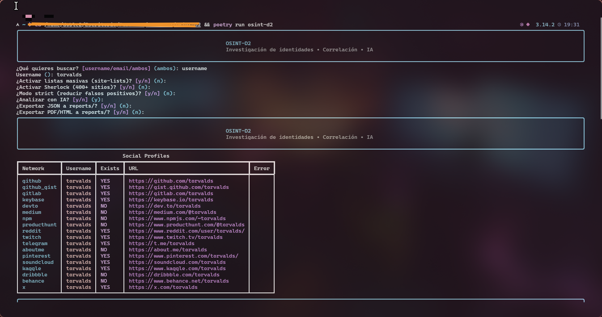

# OSINT-D2

[](#instalación)
[](#instalación)
[-111827?logo=openai&logoColor=white)](#ia--deep-analyze)
[](LICENSE)

```text
   ____  ____ ___ _   _ _____     ____  ____
  / __ \/ __ `__ \ | | |_   _|   / __ \/ __ \
 / / / / / / / / / | | | | |    / / / / / / /
/ /_/ / /_/ /_/ /| |_| | | |   / /_/ / /_/ /
\____/\__,_|\__,_| \__,_| |_|   \____/\____/
```

**Advanced Identity Correlation & Cognitive Profiling Tool**



## ¿Qué es OSINT-D2?

OSINT-D2 es una CLI para **correlación de identidades**: toma un **username** y/o un **email**, recolecta evidencia pública en múltiples fuentes y la normaliza en un agregado consistente (perfiles + metadatos + evidencia textual). Opcionalmente, aplica IA (DeepSeek / OpenAI compatible) para **convertir datos en inteligencia accionable**.

Diferencial:

- **Sherlock te dice *dónde* están. OSINT-D2 te ayuda a entender *quién* podría ser el mismo actor** (y con qué evidencia).
- No se limita a “status 200”: integra **scrapers específicos** (p. ej. GitHub/Reddit) y **enriquecimiento HTML** para añadir contexto.
- Exporta resultados en formato **forense**: JSON estructurado y **PDF tipo dossier** (WeasyPrint + Jinja2).

## Características clave

| Feature | Qué aporta |
|---|---|
| 🕵️‍♂️ **Identity Cross-Referencing** | Correlación automática **Username ↔ Email** (incluye opción de probar `localpart` del email como username). |
| 🧠 **AI Analysis (`--deep-analyze`)** | Genera un resumen y highlights basados en evidencia recolectada (IA via DeepSeek/OpenAI). |
| 🕷️ **Deep Crawling** | Enriquecimiento de evidencia con metadata + muestras textuales cuando existen (p. ej. actividad reciente). |
| 📂 **Forensic Reporting** | Export a **JSON** y **PDF/HTML dossier** con portada, índice, tablas y secciones. |
| 🚀 **Async Core** | Escaneo concurrente con `asyncio` + `httpx` para alto rendimiento. |

## Instalación

Requisitos:

- Python **3.11+**
- Poetry

Pasos:

1) Clonar:

```bash
git clone <tu-repo>
cd osint-d2
```

2) Instalar dependencias:

```bash
poetry install
```

3) Configurar `.env`:

- Copia [.env.example](.env.example) a `.env`
- Configura al menos:
	- `OSINT_D2_AI_API_KEY`
- Opcionales:
	- `OSINT_D2_AI_BASE_URL` (por defecto: DeepSeek compatible)
	- `OSINT_D2_AI_MODEL`
	- `OSINT_D2_AI_TIMEOUT_SECONDS` (si ves timeouts)

Notas sobre PDF:

- WeasyPrint está fijado a `60.1` y `pydyf` está limitado a `<0.11` por compatibilidad.

## Uso

### Wizard (modo interactivo)

Ejecuta el wizard (por defecto):

```bash
poetry run osint-d2
```

O explícitamente:

```bash
poetry run osint-d2 wizard
```

### `hunt` (modo directo: username/email/ambos)

Username:

```bash
poetry run osint-d2 hunt --username torvalds
```

Email:

```bash
poetry run osint-d2 hunt --email user@example.com
```

Ambos (correlación en una sola corrida):

```bash
poetry run osint-d2 hunt --username torvalds --email user@example.com
```

Flags útiles:

- `--site-lists`: activa listas masivas data-driven.
- `--sherlock`: activa Sherlock (manifest de ~400+ sitios).
- `--strict`: reduce falsos positivos comunes (aplica heurísticas sobre resultados Sherlock).
- `--nsfw allow|exclude`: control de sitios marcados NSFW.
- `--export-json`: guarda `reports/<target>.json`.
- `--export-pdf`: genera `reports/<target>.pdf` (fallback a HTML si falla).
- `--format json`: stdout limpio y estable para piping.

Ejemplo “modo completo”:

```bash
poetry run osint-d2 hunt \
	--username exampleuser \
	--email user@example.com \
	--site-lists \
	--sherlock \
	--strict \
	--export-pdf
```

### `scan` (username rápido)

```bash
poetry run osint-d2 scan torvalds --export-json
```

### `scan-email` (email)

```bash
poetry run osint-d2 scan-email user@example.com
```

Opcional:

```bash
poetry run osint-d2 scan-email user@example.com --scan-localpart
```

### `analyze` (reanálisis desde JSON)

```bash
poetry run osint-d2 analyze reports/<target>.json
```

## IA / `--deep-analyze`

OSINT-D2 usa el SDK de OpenAI apuntando a un endpoint compatible (por defecto DeepSeek). En modo `--deep-analyze`, el sistema construye un payload con evidencia normalizada.

Importante:

- **La IA es opcional** y puede fallar por rate-limit/timeout del proveedor.
- Considera el output como **hipótesis** basada en evidencia, no como “verdad”.

## Arquitectura (para devs)

El proyecto sigue una estructura tipo Clean Architecture:

- `src/core/`: dominio (modelos Pydantic v2), configuración y lógica agnóstica de infraestructura.
- `src/adapters/`: integraciones externas (scanners, scrapers, exporter HTML/PDF, analista IA).
- `src/cli/`: CLI Typer + Rich (wizard, hunt, export, formato JSON para pipelines).

Stack:

- `typer` + `rich` (UX de terminal)
- `httpx` + `asyncio` (I/O concurrente)
- `pydantic` v2 (modelado/validación)
- `jinja2` + `weasyprint` (reportes dossier)

## Disclaimer

Esta herramienta es para **uso legítimo, ético y educativo** (p. ej., investigación defensiva, verificación de identidad propia, brand protection, respuesta a incidentes, fraude). Respeta leyes locales, términos de servicio y privacidad.

- No uses OSINT-D2 para acoso, doxxing, stalking o ingeniería social.
- La correlación de identidades y el análisis automatizado pueden producir falsos positivos.
- El análisis por IA puede ser incorrecto o sesgado: valida siempre con evidencia primaria.

> Nota: Este repositorio se distribuye bajo licencia MIT. Ver [LICENSE](LICENSE).
